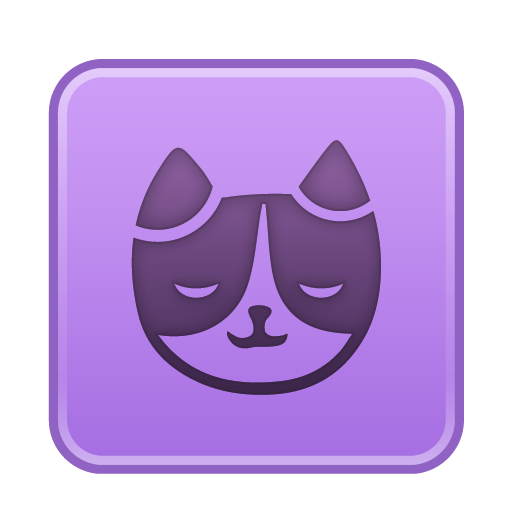
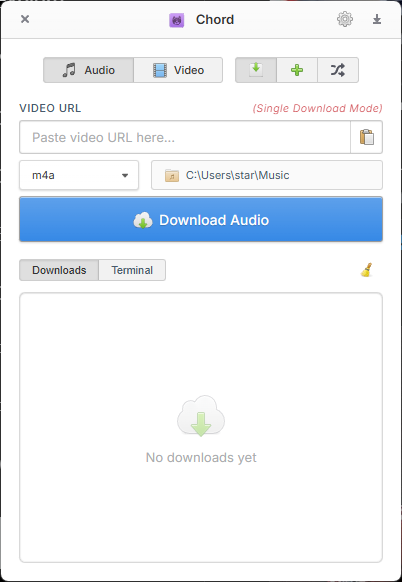
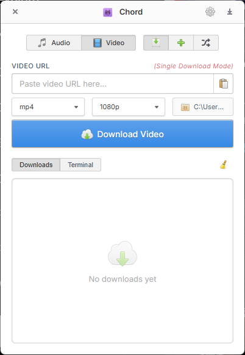
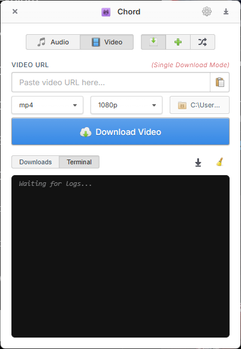
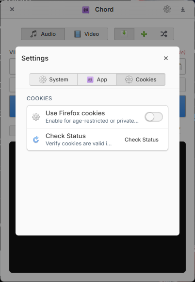
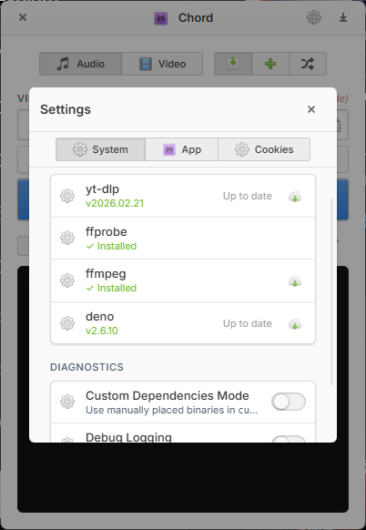

  

# Chord

  <strong>A simple yt-dlp wrapper for personal use</strong> 
  Built with Rust, Tauri, and Vanilla JavaScript.

  
  
  

  
  

---

Chord is a humble, practical wrapper for the incredible `yt-dlp` project. It was originally created for personal use to make it easier to access `yt-dlp`'s powerful downloading capabilities through a simple desktop interface.

This project exists solely because of the hard work put in by the `yt-dlp` team. Chord handles the UI and some local plumbing, but all the heavy lifting and media extraction genius is provided entirely by `yt-dlp`.

> [!IMPORTANT]
> **Alpha Build**: This project is currently in Alpha. 
> Development for **macOS** and **Linux** is ongoing and currently untested.

<table>
  <tr>
    <td></td>
    <td><strong>AI Generated Code</strong> Note: This project was vibe coded and AI was used to generate the code.</td>
  </tr>
</table>

## ✨ Features

<table>
  <tr>
    <td></td>
    <td><strong>Lightweight & Fast</strong> Minimal resource usage thanks to the Rust/Tauri backbone.</td>
    <td></td>
    <td><strong>yt-dlp Cookie Integration</strong> Leverages yt-dlp's powerful cookie features to pull session data from browsers for restricted content.</td>
  </tr>
  <tr>
    <td></td>
    <td><strong>Resumable Downloads</strong> Uses yt-dlp's robust engine to automatically handle network interruptions.</td>
    <td></td>
    <td><strong>Self-Healing</strong> Automated management of <code>yt-dlp</code> and <code>ffmpeg</code> binaries.</td>
  </tr>
</table>

### More Features
- 📜 **Playlist Support**: Granular control over playlists, powered by `yt-dlp`.
- 📦 **Batch Downloads**: Paste multiple URLs and process them sequentially.
- 🧩 **EJS Challenge Solving**: Integrated **Deno** runtime allows `yt-dlp` to execute YouTube's complex JavaScript challenges locally.
- 🔒 **Privacy First**: All processing and authentication happens locally on your machine.

## 📸 Screenshots

  
  
  

  
  

## 🏗️ Tech Stack

- **Backend**: [Rust](https://www.rust-lang.org/)
- **Framework**: [Tauri 2.0](https://tauri.app/)
- **Frontend**: HTML5, CSS3, Vanilla JavaScript / TypeScript
- **Runtime**: [Deno](https://deno.com/) (Embedded for EJS challenge solving)
- **Engine**: [yt-dlp](https://github.com/yt-dlp/yt-dlp)
- **Processor**: [FFmpeg](https://ffmpeg.org/)

## 🛠️ Installation (Windows)

1. Download the latest installer from the [Releases](https://github.com/eshdev21/chordDL/releases) page.
2. Run the `.exe` and follow the instructions.
3. Chord will automatically download the necessary dependencies (`yt-dlp`, `ffmpeg`) on first launch.

## 🤝 Contributing

Contributions are welcome! Please check the issues page or submit a pull request.

## 📜 License

Licensed under the [GPLv3 License](LICENSE).

## 🤝 Acknowledgments

- **[yt-dlp](https://github.com/yt-dlp/yt-dlp)**: Huge thanks to the `yt-dlp` team! This app is just a front for their incredible engine. We are deeply grateful for their continuous work on the most powerful media extraction tool in existence.
- **[elementary OS](https://elementary.io/)**: For the beautiful icon set and design inspiration from their stylesheet.
- **[elementary Icons](https://github.com/elementary/icons)**: The source of the elegant iconography used throughout the app.

