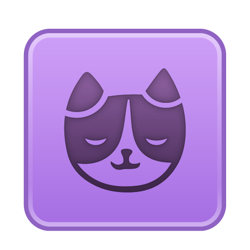
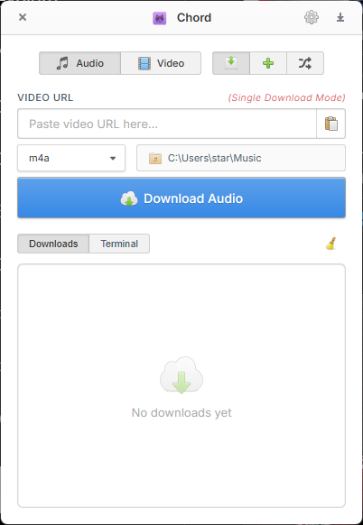
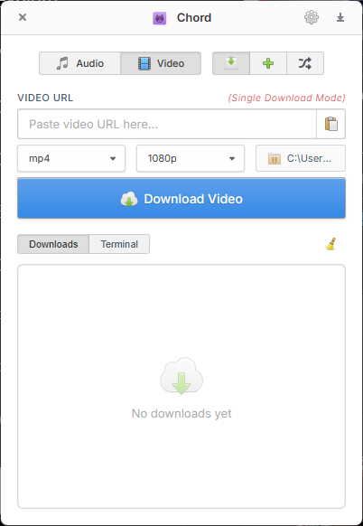
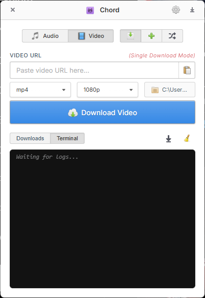
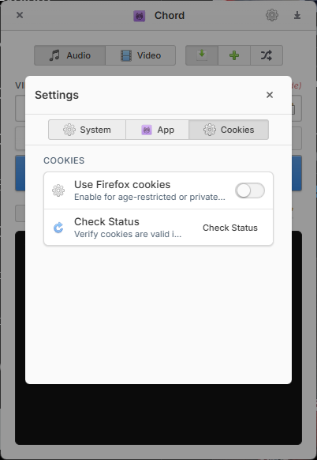
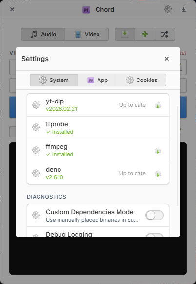

  

# Chord

  <strong>A simple yt-dlp wrapper made for personal use</strong> 
  Built with Rust, Tauri, and Vanilla JavaScript.

  
  
  

  

---

Chord is a simple `yt-dlp` wrapper built using Tauri and Rust, designed for local video and playlist downloads.

## 📸 Screenshots

  
  
  

  
  

## ✨ Features

- 📦 **Small Installer**: Minimal download size by leveraging native OS webviews.
- 🍪 **Cookie Integration**: Pull session cookies from your browser for restricted links.
- 📜 **Playlist & Batch Support**: Download complete playlists or queue multiple links.
- ⚙️ **Self-Healing**: Automated management of `yt-dlp` and `ffmpeg` binaries.

## 🛠️ Installation

1. Download the latest installer from the [Releases](https://github.com/eshdev21/chordDL/releases) page.
2. Run the `.exe` (Chord will automatically fetch `yt-dlp` and `ffmpeg` on first launch).

## 📜 License

GPLv3.

